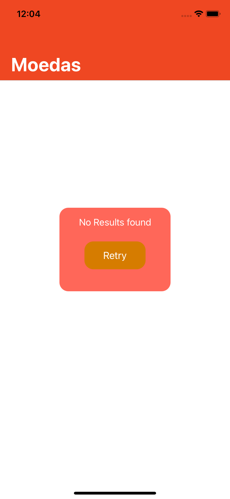

# Coins

Coins is an application to participate in the @MercadoBitcoin selection process, to make this amazing app I used **coins.io** is a free JSON API.

 

## Architecture

I opted to use **MVVM+C** because it is easy to separate responsibilities and easy to create tests.

### Coordinator pattern
To navigate between controllers using the coordinating layer without having any viewControllers references in others. While moving the navigation logic to the coordinator. Which will help reduce the huge effect of the display controller.

### Libraries

* **Swinject**: For dependency injection;
* **Lottie**: For animations;
* **SwiftLint**;

## Retry
 

## Errors Handler
public enum SwiftyRestKitError: Error {
    case parametersNil
    case encodingFailed
    case decodingFailed
    case missingURL
    case wrongURL
    case lostConnection
    case notFound
    case saveError
    case unknownError
    case timeout
    case secureConnectionFailed
    case badURL
    case hostNotFound
    case resourceNotFound
    case invalidAPIClientKey
    case serviceError
    func convertNSURLError(_ error: Error) -> SwiftyRestKitError {
        if let error = error as NSError? {
            switch error.code {
            case NSURLErrorTimedOut:
                return .timeout
            case NSURLErrorNotConnectedToInternet, NSURLErrorNetworkConnectionLost:
                return .lostConnection
            case NSURLErrorSecureConnectionFailed:
                return .secureConnectionFailed
            case NSURLErrorBadURL:
                return .badURL
            case NSURLErrorCannotFindHost:
                return .hostNotFound
            case NSURLErrorCannotDecodeRawData, NSURLErrorCannotParseResponse, NSURLErrorCannotDecodeContentData:
                return .decodingFailed
            default:
                return .unknownError
            }
        }
    }
}

## Tests
   class CoinServiceTests: XCTestCase {

    var matchService: Services!

    override func setUp() {
        super.setUp()
        matchService = Services()
    }

    override func tearDown() {
        matchService = nil
        super.tearDown()
    }

    func testFetchAllCryptoCompletes() {
        // given
        let promise = expectation(description: "Completion handler invoked")

        // when
        matchService.fetchAllCryptos { (result) in
            // Then
            promise.fulfill()
        }

        waitForExpectations(timeout: 10, handler: nil)
    }

    func testFetchAllCryptoGetsSuccessResult() {
        // given
        let promise = expectation(description: "Status code: 200")

        // when
        matchService.fetchAllCryptos { (result) in
            switch result {
            case .Success(let shows):
                XCTAssertNotNil(shows)

                promise.fulfill()
            case .Failure:
                XCTFail()
            }
        }

        waitForExpectations(timeout: 5, handler: nil)
    }
}
